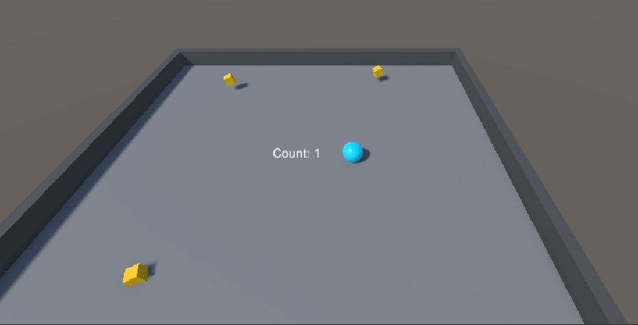
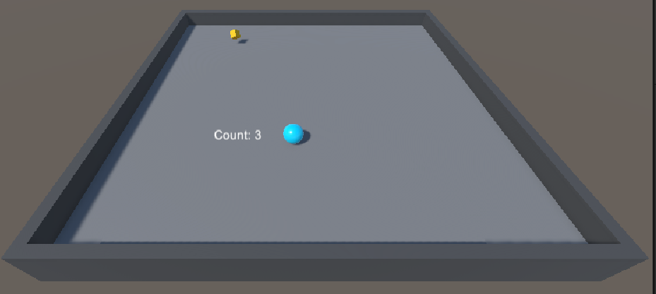
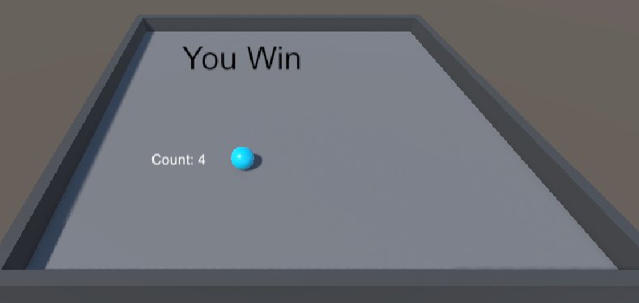

# 🎮 Roll-a-Ball 3D Game

## 📌 Description
This is a 3D Unity game where the player controls a ball to collect objects and score points.

---

## ✨ Features
- 🎮 Ball movement using physics
- 🧱 Object collection system
- 🧮 Score tracking
- 💀 Game over condition

---

## 🛠️ Built With
- Unity Engine
- C#

---

## 📸 Screenshots

### 🎮 Gameplay

### 🎯 Collecting Objects

### 🧮 Score UI

---

## 🚀 How to Run
1. Open project in Unity Hub
2. Open the main scene
3. Click ▶️ Play

---

## 👩‍💻 Author
Nikita Tiwari